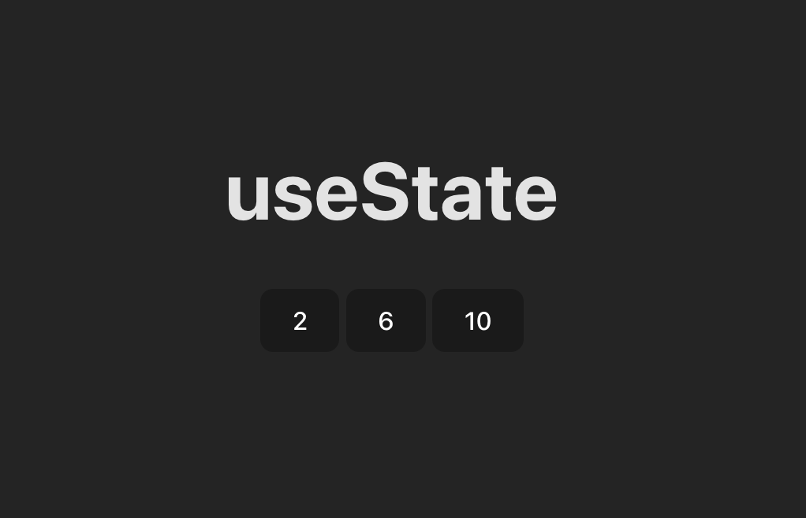

## 🧳 Section 01: *Fundamentos de React con Typescript*

<br>

## 🔧 031. Lesson 031 — *Eventos: onClick*

[🧳 Section 01: *Fundamentos de React con Typescript*](#-section-01-fundamentos-de-react-con-typescript)

### 📑 Table of Contents:
- [031. Lesson 031 — *Eventos: onClick*](#-031-lesson-031--eventos-onclick)
- [031.1 Context](#-0311-context)
- [031.2 Updating code/theory according the context](#️-0312-updating-codetheory-according-the-context)
  - [031.2.1 App entry point with MyButton component](#-03121)
  - [031.2.2 Basic onClick — function reference (no parameters)](#-03122)
  - [031.2.3 onClick with parameters — anonymous wrapper function](#-03123)
- [031.3 Issues](#-0313-issues)
- [031.4 Pending Fixes (TODO)](#-0314-pending-fixes-todo)

### 🧠 031.1 Context:

The `onClick` event is one of the most fundamental **Synthetic Events** in React. It allows components to respond to user clicks on DOM elements such as buttons, divs, links, and more. Under the hood, React wraps the native browser `click` event in a `SyntheticEvent` object, providing a consistent cross-browser API.

**Key Concepts:**

1. **Synthetic Events** — React normalises all native DOM events into `SyntheticEvent` wrappers. `onClick` is one of them and behaves identically across all browsers.
2. **Function Reference vs. Function Call** — You must pass a *reference* to a function (`onClick={handleClick}`), **not** a function *call* (`onClick={handleClick()}`). Calling the function directly causes it to execute during render instead of on click.
3. **Anonymous Wrapper Functions** — When the handler needs arguments, wrap it in an arrow function: `onClick={() => handleClick("msg")}`. This defers execution until the click actually happens.
4. **Handler Naming Convention** — The common convention is to name handlers with the `handle` prefix (e.g., `handleClick`, `handleSubmit`), matching the `on` prefix of the prop (`onClick`, `onSubmit`).
5. **Event Object** — React automatically passes the `SyntheticEvent` as the first argument to the handler. You can access it explicitly: `const handleClick = (e: React.MouseEvent) => { ... }`.

**Advantages:**
- Simple, declarative syntax for attaching click behaviour.
- Cross-browser consistency via `SyntheticEvent`.
- Easy to compose — handlers can be extracted, shared, or parameterised.
- TypeScript integration provides full type-safety for event objects.

**Disadvantages / Gotchas:**
- Calling the handler with `()` in JSX (`onClick={handleClick()}`) triggers it **at render time**, not on click. This is one of the most common beginner mistakes.
- Creating a new anonymous arrow function on every render (`onClick={() => fn()}`) generates a new reference each time, which can cause unnecessary re-renders in child components that rely on reference equality (e.g., when wrapped in `React.memo`).
- Forgetting to type the event parameter in TypeScript can lead to implicit `any` warnings.

**When to Consider Alternatives:**
- For form submissions, prefer `onSubmit` on the `<form>` element over `onClick` on a submit button.
- For keyboard-accessible interactions on non-interactive elements (e.g., `<div>`), add `onKeyDown`/`onKeyUp` alongside `onClick` and ensure proper ARIA roles.
- For complex gesture handling (drag, long-press), consider dedicated libraries such as `react-use-gesture`.

In this project, `onClick` is demonstrated in `src/components/Mybutton.tsx`, progressing from a simple no-argument handler (031.2.2) to a parameterised handler using an anonymous wrapper (031.2.3).

### ⚙️ 031.2 Updating code/theory according the context:

#### **Summary**
- This section demonstrates how to wire up a basic `onClick` event handler in a React/TypeScript component.
- It starts with the top-level `App.tsx` that renders a `MyButton` component (031.2.1).
- It then shows the simplest handler pattern — passing a function reference without arguments (031.2.2) — and explains the pitfall of accidentally *calling* the function.
- Finally, it shows how to pass arguments to the handler via an anonymous arrow function (031.2.3).
- Subsection 031.2.4 is currently empty / reserved.

#### 031.2.1 App entry point — rendering the `MyButton` component

**Subsection Summary**
- Shows the root `App.tsx`, which imports and renders the `MyButton` component.
- Sets up the page heading (`<h1>Eventos</h1>`) to provide context for the lesson topic.
- Uses a React Fragment (`<>...</>`) as the top-level wrapper.

```jsx
/* src/App.tsx */
import "./App.css";
import MyButton from "./components/Mybutton";

function App() {
  return (
    <>
      <h1>Eventos</h1>
      <MyButton />
    </>
  );
}

export default App;
```

#### 031.2.2 Basic `onClick` — passing a function reference (no parameters)

**Subsection Summary**
- Introduces the basic `onClick` pattern: defining a `handleClick` function and passing its **reference** (not its invocation) to the `onClick` prop.
- The handler simply shows a browser `alert` to confirm the click was registered.
- Highlights the critical distinction between `onClick={handleClick}` (correct) and `onClick={handleClick()}` (incorrect — executes immediately during render).
- The follow-up code block asks the reader to reason about what happens when parentheses are added.

```jsx
/* src/components/Mybutton.tsx */
import "./MyButton.css";

const Mybutton = () => {
  const handleClick = () => {                               // 👈🏽 ✅ (1)
    alert("Diste click acá!");
  };

  return (
    <div>
      <button className="btn" onClick={handleClick}>        {/* 👈🏽 ✅ (2) */}
        my button
      </button>
    </div>
  );
};

export default Mybutton;
```

* `onClick` just need the function reference only.

> What would happen when user adds `()`:
```tsx
return (
    <div>
        <button className="btn" onClick={handleClick()}>    {/* 👈🏽 ✅ (1) */}
            my button
        </button>
    </div>
)
```

#### 031.2.3 `onClick` with parameters — using an anonymous wrapper function

**Subsection Summary**
- Extends the handler to accept a `message` parameter (typed as `string`).
- Because the handler now requires an argument, you can no longer pass a bare reference; instead, an **anonymous arrow function** wraps the call: `onClick={() => handleClick("Diste click!")}`.
- Demonstrates the standard React pattern for passing custom data into event handlers without triggering them at render time.

```jsx
/* src/components/Mybutton.tsx */
import "./MyButton.css";

const Mybutton = () => {
  const handleClick = (message: string) => {
    alert(message);
  };

  return (
    <div>
      <button className="btn" onClick={() => handleClick("Diste click!")}>
        my button
      </button>
    </div>
  );
};

export default Mybutton;
```

* `handleClick` has parameters
* `onClick` must need an `anonymous` function.

### 🐞 031.3 Issues:

- **Naming inconsistency**: The file is named `Mybutton.tsx` but the import alias in `App.tsx` is `MyButton` (capital B). This works because the default export is not name-bound, but it creates a confusing mismatch between the file name and the component reference.
- **Empty subsection 031.2.4**: Subsection 031.2.4 contains an empty code block with no content.
- **Missing `React.MouseEvent` typing**: None of the handler examples demonstrate accessing or typing the native event object (`e: React.MouseEvent<HTMLButtonElement>`).

| Issue | Status | Log/Error |
|---|---|---|
| File / import naming mismatch | ⚠️ Identified | `src/App.tsx:2` imports as `MyButton` but file is `Mybutton.tsx` — inconsistent casing may cause issues on case-sensitive file systems (e.g., Linux CI). |
| Empty subsection 031.2.4 | ℹ️ Low Priority | `docs/LECTURE_STEPS.md` — 031.2.4 contains only a blank code block; consider adding an example using the `React.MouseEvent` object or removing the subsection. |
| No event-object typing example | ℹ️ Informational | `src/components/Mybutton.tsx:4` — handler omits the `event` parameter. A brief example showing `(e: React.MouseEvent<HTMLButtonElement>) => { ... }` would strengthen the lesson. |

### 🧱 031.4 Pending Fixes (TODO)

- [ ] Rename `src/components/Mybutton.tsx` to `src/components/MyButton.tsx` (and update the import in `src/App.tsx:2`) to fix the casing inconsistency.
- [ ] Add a typed-event example in subsection 031.2.4 showing `React.MouseEvent<HTMLButtonElement>` usage, e.g.:
  ```tsx
  const handleClick = (e: React.MouseEvent<HTMLButtonElement>) => {
    console.log(e.currentTarget.textContent);
  };
  ```
- [ ] Add an English explanation in subsection 031.2.2 answering the "What would happen…" question (the alert fires immediately on render; subsequent renders may loop or error).

[↑ top - 031. Lesson 031 — *Eventos: onClick*](#-031-lesson-031--eventos-onclick)


<br>

## 🔧 032. Lesson 032 — *useState*

[🧳 Section 01: *Fundamentos de React con Typescript*](#-section-01-fundamentos-de-react-con-typescript)

### 📑 Table of Contents:
- [032. Lesson 032 — *useState*](#-032-lesson-032--usestate)
- [032.1 Context](#-0321-context)
- [032.2 Updating code/theory according the context](#️-0322-updating-codetheory-according-the-context)
  - [032.2.1 Static counter button](#-03221-static-counter-button)
  - [032.2.2 App entry point with CounterButton](#-03222-app-entry-point-with-counterbutton)
  - [032.2.3 Attempting state with a local variable (broken)](#-03223-attempting-state-with-a-local-variable-broken)
  - [032.2.4 Fixing state with useState](#-03224-fixing-state-with-usestate)
- [032.3 Issues](#-0323-issues)
- [032.4 Pending Fixes (TODO)](#-0324-pending-fixes-todo)

### 🧠 032.1 Context:

`useState` is the most fundamental **React Hook**. It lets a functional component declare a piece of **reactive state** — a value that, when updated through its dedicated setter function, triggers a **re-render** of the component so the UI stays in sync with the data.

**Key Concepts:**

1. **Reactive State** — Unlike a plain `let` variable, state created by `useState` is tracked by React. Mutating a regular variable does *not* cause a re-render; calling the setter returned by `useState` does.
2. **Hook Signature** — `const [value, setValue] = useState(initialValue)`. The hook returns a two-element array: the current state value and a setter function. Array destructuring is the idiomatic way to consume it.
3. **Re-render Cycle** — When the setter is called with a new value, React schedules a re-render of the component. During the next render the hook returns the updated value, and the JSX output reflects the change.
4. **Initial Value** — The argument to `useState` (`0` in this lesson) is used only on the **first render**. Subsequent renders ignore it and return the latest state.
5. **Immutability** — State should never be mutated directly. Always use the setter; for objects or arrays, create a new reference (spread, `map`, `filter`, etc.).

**Advantages:**
- Minimal API — a single function covers the most common state management needs.
- Triggers automatic UI updates — no manual DOM manipulation.
- Works with any data type: primitives, objects, arrays, etc.
- Multiple `useState` calls can coexist in the same component, each managing independent state.

**Disadvantages / Gotchas:**
- Calling the setter does **not** update the variable synchronously within the same handler — `counter` still holds the old value until the next render.
- Using a plain local variable instead of `useState` is one of the most common beginner mistakes — the variable resets on every render and changes are invisible to the DOM.
- Storing the `useState` return in a single variable and accessing `counterState[0]` / `counterState[1]` (as shown in 032.2.4) works but is non-idiomatic — destructuring (`const [counter, setCounter] = useState(0)`) is strongly preferred.

**When to Consider Alternatives:**
- For **complex state logic** with multiple sub-values or transitions, prefer `useReducer`.
- For **global / cross-component state**, consider React Context, Zustand, Redux, or similar state-management solutions.
- For **derived data** that can be computed from existing state or props, avoid extra `useState` calls — compute the value inline instead.

In this project, `useState` is introduced in `src/components/CounterButton.tsx`. The lesson progresses from a static button (032.2.1), through a broken attempt using a local variable (032.2.3), to the working `useState`-based solution (032.2.4).

### ⚙️ 032.2 Updating code/theory according the context:

#### **Summary**
- This section walks through a step-by-step introduction to the `useState` hook by building a simple counter button.
- Subsection 032.2.1 shows the static starting point — a button that always displays `0`.
- Subsection 032.2.2 shows the `App.tsx` entry point that renders the `CounterButton` component.
- Subsection 032.2.3 demonstrates the **wrong** approach: using a plain local variable for state. The variable mutates (visible in `console.log`), but the DOM never updates.
- Subsection 032.2.4 fixes the problem by introducing `useState`, showing how the setter triggers a re-render and keeps the UI in sync.
- Subsections 032.2.5 and 032.2.6 are currently reserved / empty.

#### 032.2.1 Static `counter` button

**Subsection Summary**
- Defines the initial `CounterButton` component as a simple button that renders a hard-coded `0`.
- Serves as the baseline before any interactivity or state is introduced.
- The component is a pure functional component with no props, state, or event handlers.

```jsx
/* src/components/CounterButton.tsx */
const CounterButton = () => {
  return (
    <button>0</button>
  )
}
export default CounterButton;
```

#### 032.2.2 App entry point with `CounterButton`

**Subsection Summary**
- Shows the root `App.tsx`, which imports and renders the `CounterButton` component.
- Sets up the page heading (`<h1>useState</h1>`) to provide context for the lesson topic.
- Uses a React Fragment (`<>...</>`) as the top-level wrapper.

```jsx
/* src/App.tsx */
import "./App.css";
import CounterButton from "./components/CounterButton";

function App() {
  return (
    <>
      <h1>useState</h1>
      <CounterButton />
    </>
  );
}
export default App;
```

#### 032.2.3 Attempting state with a local variable (broken)

**Subsection Summary**
- Introduces a local `let counter = 0` variable and a `handleClickIncrement` handler that mutates it on each click.
- The `console.log` output confirms the variable is being incremented, but the **UI never re-renders** — the button always displays `0`.
- This demonstrates the core problem that `useState` solves: React does not track plain variables and therefore cannot know when to re-render.
- The accompanying screenshot (`section01-lecture032-001.png`) visually illustrates the mismatch between the console output (incrementing) and the DOM (static `0`).

```jsx
/* src/components/CounterButton.tsx */
const CounterButton = () => {
  let counter = 0;                                                  // 👈🏽 ✅ (1)

  const handleClickIncrement = () => {                              // 👈🏽 ✅ (2)
    counter = counter + 1;
    console.log("counter: ", counter);
  }
  return (
    <button onClick={handleClickIncrement}>{counter}</button>       {/* 👈🏽 ✅ (3) */}
  )
}

export default CounterButton;
```

Issue:
* *console.log() is showing the changes.
* *UI or DOM stays unmutable.


#### 032.2.4 Fixing state with `useState`

**Subsection Summary**
- Replaces the plain local variable with the `useState` hook: `const counterState = useState(0)`.
- Accesses the current value via `counterState[0]` and the setter via `counterState[1]`.
- The `handleClickIncrement` handler now calls `setCounter(newValue)`, which triggers a re-render and updates the DOM.
- The accompanying screenshot (`section01-lecture032-002.png`) shows the UI correctly reflecting the updated counter value.
- **Note:** The code uses array-index access instead of idiomatic destructuring (`const [counter, setCounter] = useState(0)`) — see Issues section.

```jsx
/* src/components/CounterButton.tsx */
import { useState } from "react";                                       // 👈🏽 ✅ (1)

const CounterButton = () => {
  //let counter = 0;
  const counterState = useState(0);                                     // 👈🏽 ✅ (2)

  const counter = counterState[0];                                      // 👈🏽 ✅ (3)
  const setCounter = counterState[1];                                   // 👈🏽 ✅ (3)

  const handleClickIncrement = () => {
    const newValue = counter + 1;
    setCounter(newValue);                                               // 👈🏽 ✅ (4)
    //counter = counter + 1;
    //console.log("counter: ", newValue);
  }
  return (
    <button onClick={handleClickIncrement}>{counter}</button>
  )
}
export default CounterButton;
```


### 🐞 032.3 Issues:

| Issue | Status | Log/Error |
|---|---|---|
| Missing image `section01-lecture032-000.png` | ✅ Fixed | `docs/LECTURE_STEPS.md:273` — referenced image did not exist on disk. Changed to `section01-lecture032-002.png`. |
| Non-idiomatic `useState` destructuring | ⚠️ Identified | `src/components/CounterButton.tsx:5-8` — uses `counterState[0]` / `counterState[1]` instead of `const [counter, setCounter] = useState(0)`. |

### 🧱 032.4 Pending Fixes (TODO)

- [ ] Refactor `src/components/CounterButton.tsx:5-8` to use idiomatic array destructuring:
  ```tsx
  const [counter, setCounter] = useState(0);
  ```
- [ ] Consider adding a functional updater example showing `setCounter(prev => prev + 1)` to teach the callback pattern.

[↑ top - 032. Lesson 032 — *useState*](#-032-lesson-032--usestate)

<br>

## 🔧 033. Lesson 033 — *Array Destructuring*

[🧳 Section 01: *Fundamentos de React con Typescript*](#-section-01-fundamentos-de-react-con-typescript)

### 📑 Table of Contents:
- [033. Lesson 033 — *Array Destructuring*](#-033-lesson-033--array-destructuring)
- [033.1 Context](#🧠-0331-context)
- [033.2 Updating code/theory according the context](#️⚙️-0332-updating-codetheory-according-the-context)
  - [033.2.1 Basic array destructuring](#03321-basic-array-destructuring)
  - [033.2.2 Destructuring `useState` result](#03322-destructuring-usestate-result)
- [033.3 Issues](#🐞-0333-issues)
- [033.4 Pending Fixes (TODO)](#🧱-0334-pending-fixes-todo)

---

### 🧠 033.1 Context:

**Array destructuring** is a JavaScript syntax feature that allows extracting values from an array and assigning them to variables in a single, concise expression.

Instead of accessing elements by index (`arr[0]`, `arr[1]`, etc.), destructuring enables positional assignment:

```ts
const [a, b, c] = myArray;
```

This is heavily used in React, especially with Hooks such as `useState`, which return arrays.

**Key Concepts:**

1. **Positional Mapping** — Variables receive values based on their position in the array, not by name.
2. **Multiple Assignment** — Several variables can be declared and initialized in one line.
3. **Hook Consumption Pattern** — React Hooks rely on array destructuring to expose state and setter functions.
4. **Immutability Friendly** — Destructuring does not mutate the original array.
5. **Readable Intent** — Makes code more expressive and avoids repetitive index access.

**Advantages:**
- Cleaner and more readable syntax.
- Eliminates repeated index-based access (`arr[0]`, `arr[1]`).
- Standard idiom for React Hooks (`useState`, `useReducer`, etc.).
- Encourages consistent variable naming.
- Reduces boilerplate code.

**Disadvantages / Gotchas:**
- Order matters — swapping positions changes meaning.
- Skipping elements without placeholders may cause confusion.
- Destructuring from `undefined` causes runtime errors.
- Overusing destructuring on large arrays can reduce clarity.

**When to Consider Alternatives:**
- When only one element is needed, direct indexing (`arr[0]`) may be clearer.
- When working with objects, object destructuring is usually preferable.
- When the array structure is not guaranteed (e.g., dynamic API responses).

In this project, array destructuring is introduced first with a simple fruit emoji array and then applied directly to the `useState` hook return value in `src/components/CounterButton.tsx`.

---

### ⚙️ 033.2 Updating code/theory according the context:

#### **Summary**
- This section introduces array destructuring using a simple fruit emoji array.
- It compares traditional index-based access with destructuring syntax.
- It then applies destructuring to the array returned by `useState`.
- The lesson transitions from a non-idiomatic state access pattern to the idiomatic React style.
- Subsection 033.2.2 shows the final simplified implementation.

---

#### 033.2.1 Basic array destructuring

**Subsection Summary**
- Demonstrates how to extract array values using index access.
- Rewrites the same logic using destructuring syntax.
- Logs both approaches to show they produce the same result.
- Establishes the mental model needed for Hook destructuring.
- Uses a simple static array to avoid React-specific complexity.

```jsx
/* src/components/CounterButton.tsx */
import { useState } from "react";

const myArr = ["🍐", "🍉", "🍅"];
const pear = myArr[0];
const watermelon = myArr[1];
const tomato = myArr[2];
console.log(pear);
console.log(watermelon);
console.log(tomato);

// applying destructuring:
const [myPear, myWatermelon, myTomato] = myArr;
console.log("myPear: ", myPear);
console.log("myWatermelon: ", myWatermelon);
console.log("myTomato: ", myTomato);

const CounterButton = () => {
  const counterState = useState(0);
  const counter = counterState[0];
  const setCounter = counterState[1];

  const handleClickIncrement = () => {
    const newValue = counter + 1;
    setCounter(newValue);
  }

  return (
    <button onClick={handleClickIncrement}>{counter}</button>
  )
}
export default CounterButton;
```

---

#### 033.2.2 Destructuring `useState` result

**Subsection Summary**
- Replaces manual index access (`counterState[0]`, `counterState[1]`) with destructuring.
- Demonstrates the canonical React Hook pattern.
- Improves readability and reduces the chance of positional mistakes.
- Aligns the code with standard React conventions.
- Shows the final simplified component version.

```jsx
/* src/components/CounterButton.tsx */
import { useState } from "react";

const CounterButton = () => {
  const [counter, setCounter] = useState(0);                      // 👈🏽 ✅ (1)

  const handleClickIncrement = () => {
    const newValue = counter + 1;
    setCounter(newValue);
  }

  return (
    <button onClick={handleClickIncrement}>{counter}</button>
  )
}
export default CounterButton;
```

---

### 🐞 033.3 Issues:

- **Non-idiomatic state access**: The first example still uses `counterState[0]` and `counterState[1]`.
- **Console-only demonstration**: The destructuring of `myArr` is shown only via `console.log`.
- **No error-handling example**: The lesson does not explain what happens if destructuring is applied to `undefined`.

| Issue | Status | Log/Error |
|---|---|---|
| Index-based `useState` access | ⚠️ Identified | `src/components/CounterButton.tsx:10-11` — uses `counterState[0]` and `counterState[1]` instead of destructuring. |
| Console-only fruit example | ℹ️ Informational | `src/components/CounterButton.tsx:4-9` — destructuring result is only visible in logs. |
| Missing invalid-destructuring explanation | ℹ️ Low Priority | Lesson 033 — no example showing runtime error when destructuring `undefined`. |

---

### 🧱 033.4 Pending Fixes (TODO)

- [ ] Refactor `src/components/CounterButton.tsx:10-11` to use destructuring consistently:
  ```ts
  const [counter, setCounter] = useState(0);
  ```
- [ ] Add a short example showing what happens when destructuring from an undefined array:
  ```ts
  const [a] = undefined; // runtime error
  ```
- [ ] Add a visual example rendering destructured fruit values in JSX instead of only logging them.
- [ ] Add a comparison note between array destructuring and object destructuring.

[↑ top - 033. Lesson 033 — *Array Destructuring*](#-033-lesson-033--array-destructuring)


<br>

## 🔧 034. Lesson 034 — *Sharing state between Components*

[🧳 Section 01: *Fundamentos de React con Typescript*](#-section-01-fundamentos-de-react-con-typescript)

### 📑 Table of Contents:
- [034. Lesson 034 — *Sharing state between Components*](#-034-lesson-034--sharing-state-between-components)
- [034.1 Context](#-0341-context)
- [034.2 Updating code/theory according the context](#️-0342-updating-codetheory-according-the-context)
  - [034.2.1 Multiple components with independent state](#-03421-multiple-components-with-independent-state)
  - [034.2.2 Lifting state up — shared state in parent](#-03422-lifting-state-up--shared-state-in-parent)
  - [034.2.3 Typed Props interface for CounterButton](#-03423-typed-props-interface-for-counterbutton)
- [034.3 Issues](#-0343-issues)
- [034.4 Pending Fixes (TODO)](#-0344-pending-fixes-todo)

### 🧠 034.1 Context:

**Sharing state between components** is a fundamental pattern in React where multiple components need to read or update the same piece of data. React's one-way data flow means state lives in a component and is passed down to children via **props**. When several siblings must share state, the solution is to **lift state up** — move the state into their common parent.

**Key Concepts:**

1. **Lifting State Up** — When two or more components need access to the same state, move the `useState` call from the child into the **closest common ancestor**. The parent owns the state and passes it down as props.
2. **Single Source of Truth** — Keeping state in one place avoids sync issues. Multiple components read the same `counter` value because they all receive it from the parent.
3. **Props for Data and Callbacks** — Parent passes both the state value (`counter`) and an updater function (`handleClickIncrement`) as props. Children call the callback to request updates; the parent performs the update.
4. **Controlled vs. Uncontrolled** — A component that receives its value and onChange-style handler from props is **controlled**; it has no local state for that value.
5. **Rules of Hooks** — Hooks must be called unconditionally at the top level of a component. Lifting state up ensures each component that needs a hook owns it correctly.

**Advantages:**

- Single source of truth — no risk of conflicting copies of state.
- Predictable data flow — data flows down, events bubble up.
- Easier debugging — state lives in one component.
- Reusable presentational components — children stay dumb/stateless.
- Straightforward to reason about and test.

**Disadvantages / Gotchas:**

- Prop drilling — many layers of components passing props down.
- Parent re-renders can cascade — lifting state higher can cause more re-renders.
- Callback props add boilerplate — each child needs both value and setter.
- Over-lifting can bloat the parent — too much logic in one place.

**When to Consider Alternatives:**

- **Prop drilling** across many levels → Context API, Zustand, or Jotai.
- **Complex or deeply nested state** → `useReducer` or external store.
- **Server state, caching, or async** → React Query, SWR, or similar.
- **Form state across fields** → dedicated form libraries (React Hook Form, Formik).

In this project, state sharing is shown by moving `counter` and `handleClickIncrement` from `CounterButton` into `App.tsx`. Both buttons render the same value and update the same state (034.2.1 → 034.2.3).

### ⚙️ 034.2 Updating code/theory according the context:

#### **Summary**
- This section teaches how to share state between multiple instances of the same component.
- Subsection 034.2.1 shows multiple `CounterButton` components, each with its own independent state — three separate counters.
- Subsection 034.2.2 **lifts state up** into `App`: the parent holds `useState`, and both buttons receive `counter` and `handleClickIncrement` as props. Both buttons now share a single counter value.
- Subsection 034.2.3 adds a TypeScript `Props` interface so `CounterButton` receives correctly typed props.
- Subsections 034.2.4 and 034.2.5 are reserved / empty.

#### 034.2.1 Multiple components with independent state

**Subsection Summary**
- Renders three `CounterButton` components from `App.tsx`.
- Each `CounterButton` owns its own `useState` internally, so each counter is independent.
- The screenshot (`section01-lecture034-001.png`) illustrates the three separate counters.
- Reinforces the Rules of Hooks: Hooks must be called at the top level, not inside loops or conditions.

```jsx
/* src/App.tsx */
import "./App.css";
import CounterButton from "./components/CounterButton";

function App() {
  return (
    <>
      <h1>useState</h1>
      <CounterButton /> {" "}
      <CounterButton /> {" "}
      <CounterButton />
    </>
  );
}

export default App;
```

* Having more than one `component`.
* Each `component` has a `state`.
* The `state` is independent in each `component`.



* ***Only call Hooks at the top level. Don’t call Hooks inside loops, conditions, or nested functions.***

#### 034.2.2 Lifting state up — shared state in parent

**Subsection Summary**
- Moves `useState` and `handleClickIncrement` from `CounterButton` into `App`.
- Both `CounterButton` instances receive `counter` and `handleClickIncrement` as props.
- The child becomes a controlled component: it displays `counter` and calls the parent's handler on click.
- Introduces props as the mechanism for sharing data and event handlers between components.

```jsx
/* src/App.tsx */
import { useState } from "react";
import "./App.css";
import CounterButton from "./components/CounterButton";

function App() {
  const [counter, setCounter] = useState(0);
  const handleClickIncrement = () => {
    const newValue = counter + 1;
    setCounter(newValue);
  };
  return (
    <>
      <h1>useState</h1>
      <CounterButton
        counter={counter}
        handleClickIncrement={handleClickIncrement} 
      /> {" "}
      <CounterButton counter={counter}
        handleClickIncrement={handleClickIncrement} 
      />
    </>
  );
}
export default App;
```

meantime:

```tsx
/* src/components/CounterButton.tsx */
// import { useState } from "react";

const CounterButton = ({ counter, handleClickIncrement }) => {
  //const [counter, setCounter] = useState(0);
  // const handleClickIncrement = () => {
  //   const newValue = counter + 1;
  //   setCounter(newValue);
  // }
  return (
    <button onClick={handleClickIncrement}>{counter}</button>
  )
}
export default CounterButton;
```

Issues:
* Props don't have type.

---

**Sharing data between components:**
```
Props (properties) are the way React components can receive data from their parents. You can think of them as attributes of an HTML element, but in React they are much more powerful because they can be any type of data: strings, numbers, objects, functions, etc.
```

#### 034.2.3 Typed Props interface for CounterButton

**Subsection Summary**
- Adds a TypeScript `Props` interface with `counter: number` and `handleClickIncrement: () => void`.
- Destructures and types the props in the component signature.
- Fixes the typeless-props issue from 034.2.2 and aligns with TypeScript best practices.
- The screenshot (`section01-lecture034-002.png`) shows the shared counter working with both buttons.

```jsx
/* src/components/CounterButton.tsx */
interface Props {
  counter: number
  handleClickIncrement: () => void
}
const CounterButton = ({ counter, handleClickIncrement }: Props) => {
  return (
    <button onClick={handleClickIncrement}>{counter}</button>
  )
}
export default CounterButton;
```


### 🐞 034.3 Issues:

- **Typo in documentation**: The lesson text uses "do't" instead of "don't" when referring to props typing (corrected in 034.2.2).
- **Commented code in component**: `CounterButton.tsx` contains commented-out `useState` and handler code that can be removed for clarity.
- **Inconsistent button count**: `App.tsx` shows two `CounterButton` instances after lifting state, while 034.2.1 shows three — the third button was dropped without explanation.

| Issue | Status | Log/Error |
|---|---|---|
| Typo "do't" → "don't" | ✅ Fixed | `docs/LECTURE_STEPS.md` — corrected to "Props don't have type" in subsection 034.2.2. |
| Commented-out code in CounterButton | ⚠️ Identified | `src/components/CounterButton.tsx:1, 9-14` — commented `useState` and handler remain from refactor; can be removed. |
| Inconsistent button count (3 vs 2) | ℹ️ Informational | `src/App.tsx` — 034.2.1 shows three counters; 034.2.2/034.2.3 show two. Either add a third or document the intentional reduction. |

### 🧱 034.4 Pending Fixes (TODO)

- [ ] Remove commented-out code from `src/components/CounterButton.tsx` (lines 1, 9-14) for a cleaner final version.
- [ ] Consider adding a functional updater example: `setCounter(prev => prev + 1)` to avoid stale closure issues when handlers are memoized or passed through layers.
- [ ] Decide whether to add a third `CounterButton` in `App.tsx` for the shared-state examples, or add a note in the lesson explaining why only two are used.

[↑ top - 034. Lesson 034 — *Sharing state between Components*](#-034-lesson-034--sharing-state-between-components)


## 🧳 Section 02: *Forms in React + TypeScript*

<br>

## 🔧 036. Lesson 036 — *Controlled vs Uncontrolled Forms*

[🧳 Section 02: *Forms in React + TypeScript*](#-section-02-forms-in-react--typescript)

### 📑 Table of Contents:
- [036. Lesson 036 — *Controlled vs Uncontrolled Forms*](#-036-lesson-036--controlled-vs-uncontrolled-forms)
- [036.1 Context](#-0361-context)
- [036.2 Updating code/theory according the context](#️-0362-updating-codetheory-according-the-context)
  - [036.2.1 Uncontrolled form with useRef](#-03621-uncontrolled-form-with-useref)
  - [036.2.2 Uncontrolled form with FormData](#-03622-uncontrolled-form-with-formdata)
  - [036.2.3 Basic controlled input](#-03623-basic-controlled-input)
  - [036.2.4 Controlled form with onSubmit](#-03624-controlled-form-with-onsubmit)
  - [036.2.5 Full controlled form — text, select, checkbox](#-03625-full-controlled-form--text-select-checkbox)
- [036.3 Issues](#-0363-issues)
- [036.4 Pending Fixes (TODO)](#-0364-pending-fixes-todo)

### 🧠 036.1 Context:

In React, form inputs can be handled in two ways: **controlled** or **uncontrolled**. Understanding both patterns is essential for choosing the right approach for validation, real-time feedback, and integration with React state.

**Key Concepts:**

1. **Controlled components** — The input value is stored in React state and bound via `value` (or `checked` for checkboxes). Every keystroke updates the state via `onChange`, and the input displays the state value. React is the *single source of truth*.
2. **Uncontrolled components** — The DOM owns the input value. You read it when needed (e.g. on submit) via `useRef` or `FormData`. No `value` prop is passed; the input is "uncontrolled" by React.
3. **`useRef` and DOM access** — `useRef<HTMLInputElement>(null)` gives a reference to the DOM node. After render, `ref.current` points to the element, so you can read `ref.current?.value` without triggering re-renders.
4. **`FormData`** — A native Web API constructor that builds key/value pairs from form elements. Use `new FormData(formRef.current)` and `formData.get("fieldName")` to read values. Works best with `name` attributes.
5. **`value` vs `defaultValue`** — In controlled mode you use `value={state}`; in uncontrolled mode you may use `defaultValue` for initial value only. Mixing `value` without `onChange` (or vice versa) leads to a read-only or broken input.

**Advantages:**
- **Controlled**: Predictable state, easy validation, real-time UI feedback, and full control over input behaviour.
- **Uncontrolled**: Fewer re-renders, less boilerplate, simple for one-off forms, and closer to traditional HTML form behaviour.

**Disadvantages / Gotchas:**
- **Controlled**: More state and handlers; each keystroke causes a re-render.
- **Uncontrolled**: Validation and feedback require reading DOM or FormData; harder to reset or programmatically change values.
- Passing `value` without `onChange` (or the inverse) can make an input read-only or throw React warnings.
- Checkboxes use `checked` and `e.target.checked`, not `value`.

**When to Consider Alternatives:**
- Complex forms with many fields and validation → React Hook Form, Formik, or TanStack Form.
- When you need to avoid re-renders on every keystroke → uncontrolled with `FormData` or `useRef`.
- When integrating with non-React code (e.g. legacy libs) → uncontrolled may be simpler.

Reference: [Controlled vs Uncontrolled Forms (bluuweb)](https://bluuweb.dev/react-ts/02-fundamentos-react.html#formularios) and [React: Controlling an input with a state variable](https://react.dev/reference/react-dom/components/input#controlling-an-input-with-a-state-variable).

### ⚙️ 036.2 Updating code/theory according the context:

#### **Summary**
- This section covers both uncontrolled and controlled form patterns in React with TypeScript.
- Subsection 036.2.1 shows an uncontrolled form using `useRef` to read a single input value on submit.
- Subsection 036.2.2 demonstrates an uncontrolled form with multiple fields (text, select, checkbox) using `FormData`.
- Subsection 036.2.3 introduces the basic controlled pattern: `useState` + `value` + `onChange` for a single input.
- Subsection 036.2.4 adds `onSubmit` to handle form submission in a controlled form.
- Subsection 036.2.5 shows a full controlled form (username, color select, checkbox) as the equivalent of the uncontrolled example from 036.2.2.

#### 036.2.1 Uncontrolled form with useRef

**Subsection Summary**
- Uses `useRef<HTMLInputElement>(null)` to keep a reference to the input without causing re-renders.
- Reads the value only on submit via `inputRef.current?.value`.
- The input has no `value` or `onChange` props; the DOM owns the value.
- Calls `e.preventDefault()` to avoid default form submission and page reload.

```jsx
/* src/components/UncontrolledForm.tsx */
import { useRef, type FormEvent } from "react";

const UncontrolledForm = () => {
  const inputRef = useRef<HTMLInputElement>(null);

  const handleSubmit = (e: FormEvent) => {
    e.preventDefault();
    console.log(inputRef.current?.value); // Optional Chaining Operator
  };

  return (
    <div>
      <h2>Uncontrolled (useRef)</h2>
      <form onSubmit={handleSubmit}>
        <input type="text" ref={inputRef} />
        <button type="submit">Agregar</button>
      </form>
    </div>
  );
};

export default UncontrolledForm;
```

#### 036.2.2 Uncontrolled form with FormData

**Subsection Summary**
- Uses `useRef<HTMLFormElement>(null)` to reference the whole form.
- On submit, builds a `FormData` from the form DOM element.
- Reads values with `formData.get("fieldName")` — each input must have a `name` attribute.
- Checkboxes: unchecked → `null`; checked → `"on"` (or custom `value`). Use `!!formData.get("accept")` to convert to boolean.
- `select` uses `defaultValue` for initial selection (uncontrolled).

```jsx
/* src/components/UncontrolledFormData.tsx */
import { useRef, type FormEvent } from "react";

const UncontrolledFormData = () => {
  const formRef = useRef<HTMLFormElement>(null);

  const handleSubmit = (e: FormEvent) => {
    e.preventDefault();
    if (!formRef.current) return;

    const formData = new FormData(formRef.current);
    const username = formData.get("username");
    const color = formData.get("color");
    const accept = !!formData.get("accept");

    console.log({ username, color, accept });
  };

  return (
    <div>
      <h2>Uncontrolled (FormData)</h2>
      <form onSubmit={handleSubmit} ref={formRef}>
        <input type="text" name="username" placeholder="Your username" />
        <br />
        <select name="color" defaultValue="">
          <option value="" disabled>Choose a color</option>
          <option value="red">Red</option>
          <option value="blue">Blue</option>
          <option value="green">Green</option>
        </select>
        <br />
        <label>
          <input type="checkbox" name="accept" />
          I accept the terms
        </label>
        <button type="submit">Submit</button>
      </form>
    </div>
  );
};

export default UncontrolledFormData;
```

#### 036.2.3 Basic controlled input

**Subsection Summary**
- Introduces the controlled pattern: `value={text}` and `onChange={(e) => setText(e.target.value)}`.
- The input displays exactly what is in state; state updates on every keystroke.
- Renders the current value below the input for real-time feedback.
- React is the single source of truth for the input value.

```jsx
/* src/components/ControlledForm.tsx */
import { useState } from "react";

const ControlledForm = () => {
  const [text, setText] = useState("");

  return (
    <div>
      <h2>Controlled (basic)</h2>
      <input
        type="text"
        value={text}
        onChange={(e) => setText(e.target.value)}
      />
      <p>{text}</p>
    </div>
  );
};

export default ControlledForm;
```

#### 036.2.4 Controlled form with onSubmit

**Subsection Summary**
- Extends the controlled input with a `<form>` and `onSubmit` handler.
- `e.preventDefault()` stops the default form submission and page reload.
- The input value is already in state, so no DOM access is needed on submit.
- The submitted value is echoed in an `<h2>` for visual confirmation.

```jsx
/* src/components/ControlledForm.tsx */
import { useState, type FormEvent } from "react";

const ControlledForm = () => {
  const [text, setText] = useState("");

  const handleSubmit = (e: FormEvent) => {
    e.preventDefault();
    console.log(text);
  };

  return (
    <div>
      <h2>Controlled (with onSubmit)</h2>
      <form onSubmit={handleSubmit}>
        <input
          type="text"
          value={text}
          onChange={(e) => setText(e.target.value)}
        />
        <button type="submit">Agregar</button>
      </form>
      <h3>{text}</h3>
    </div>
  );
};

export default ControlledForm;
```

#### 036.2.5 Full controlled form — text, select, checkbox

**Subsection Summary**
- Shows the controlled equivalent of the FormData example: username, color select, and accept checkbox.
- Each field uses `useState` and is bound with `value`/`checked` and `onChange`.
- Checkbox uses `checked={accept}` and `onChange={(e) => setAccept(e.target.checked)}` instead of `value`.
- Select uses `value={color}` and `onChange`; options include a disabled empty option for initial state.
- All values are available in state for validation and submission without DOM access.

```jsx
/* src/components/ControlledFormFull.tsx */
import { useState, type FormEvent } from "react";

const ControlledFormFull = () => {
  const [username, setUsername] = useState("");
  const [color, setColor] = useState("");
  const [accept, setAccept] = useState(false);

  const handleSubmit = (e: FormEvent) => {
    e.preventDefault();
    console.log({ username, color, accept });
  };

  return (
    <div>
      <h2>Controlled (full form)</h2>
      <form onSubmit={handleSubmit}>
        <input
          type="text"
          placeholder="Your username"
          value={username}
          onChange={(e) => setUsername(e.target.value)}
        />
        <br />
        <select
          value={color}
          onChange={(e) => setColor(e.target.value)}
        >
          <option value="" disabled>Choose a color</option>
          <option value="red">Red</option>
          <option value="blue">Blue</option>
          <option value="green">Green</option>
        </select>
        <br />
        <label>
          <input
            type="checkbox"
            checked={accept}
            onChange={(e) => setAccept(e.target.checked)}
          />
          I accept the terms
        </label>
        <button type="submit">Submit</button>
      </form>
    </div>
  );
};

export default ControlledFormFull;
```

### 🐞 036.3 Issues:

- **Form components not yet implemented**: The project does not contain `UncontrolledForm`, `UncontrolledFormData`, `ControlledForm`, or `ControlledFormFull` components. The lesson documents the patterns but no corresponding code exists in `src/components/`.
- **No App entry point for forms**: `src/App.tsx` currently renders `CounterButton`; there is no route or section to display the form examples from Section 02.
- **Typo in external reference**: The bluuweb link text previously read "Uncontrold" instead of "Uncontrolled".
- **Accessibility considerations**: Form examples omit `htmlFor`/`id` for labels, `aria-label` for inputs without visible labels, and `aria-invalid`/`aria-describedby` for validation feedback.

| Issue | Status | Log/Error |
|---|---|---|
| Form components missing | ⚠️ Identified | `src/components/` — `UncontrolledForm.tsx`, `UncontrolledFormData.tsx`, `ControlledForm.tsx`, `ControlledFormFull.tsx` are referenced in the lesson but do not exist. |
| No forms in App | ⚠️ Identified | `src/App.tsx` — Only renders Section 01 components; no integration point for Section 02 form examples. |
| Link text typo "Uncontrold" | ✅ Fixed | `docs/LECTURE_STEPS.md` — Corrected to "Uncontrolled" in reference link. |
| Missing form accessibility attributes | ℹ️ Low Priority | Lesson 036 code examples — Labels lack `htmlFor`/`id`; no `aria-invalid` or `aria-describedby` for validation. |

### 🧱 036.4 Pending Fixes (TODO)

- [ ] Create `src/components/UncontrolledForm.tsx` implementing the useRef pattern from subsection 036.2.1.
- [ ] Create `src/components/UncontrolledFormData.tsx` implementing the FormData pattern from subsection 036.2.2.
- [ ] Create `src/components/ControlledForm.tsx` (or a combined component) implementing subsections 036.2.3 and 036.2.4.
- [ ] Create `src/components/ControlledFormFull.tsx` implementing the full controlled form from subsection 036.2.5.
- [ ] Update `src/App.tsx` to include a Section 02 demo area (e.g. conditional render or tab) that showcases the form components.
- [ ] Add accessibility attributes to form examples: `htmlFor`/`id` on labels, `aria-label` where appropriate, `aria-invalid`/`aria-describedby` for validation states.

[↑ top - 036. Lesson 036 — *Controlled vs Uncontrolled Forms*](#-036-lesson-036--controlled-vs-uncontrolled-forms)


---

<br>
<br>
<br>

🔥 🔥 🔥 

<br>

## 🔧 XXX. Lesson XXX — *{{TITLE_NAME}}*

### 🧠 XXX.1 Context:

### ⚙️ XXX.2 Updating code/theory according the context:

#### XXX.2.1
```jsx
/*  */

```

#### XXX.2.2
```jsx
/*  */

```

#### XXX.2.3
```jsx
/*  */

```

#### XXX.2.4
```jsx
/*  */

```

#### XXX.2.5
```jsx
/*  */

```

### 🐞 XXX.3 Issues:
- **first issue**: something..

| Issue | Status | Log/Error |
|---|---|---|

### 🧱 XXX.4 Pending Fixes (TODO)

- [ ]