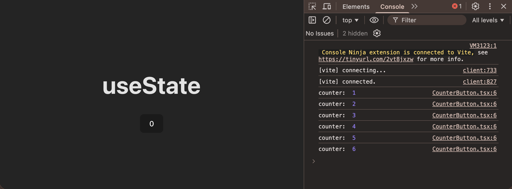
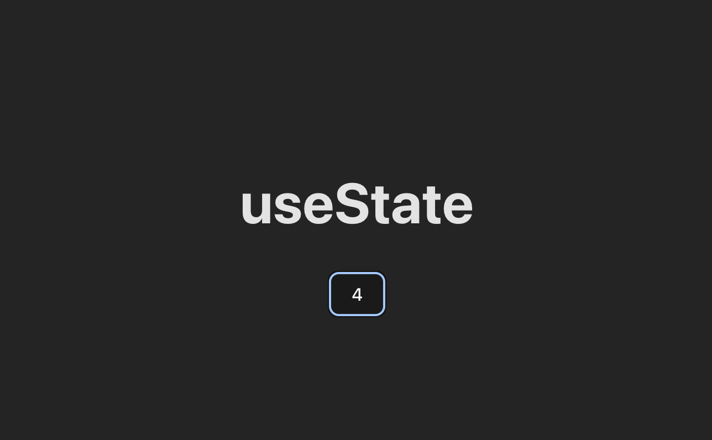

## 🧳 Section 01: *Fundamentos de React con Typescript*

<br>

## 🔧 031. Lesson 031 — *Eventos: onClick*

[🧳 Section 01: *Fundamentos de React con Typescript*](#-section-01-fundamentos-de-react-con-typescript)

### 📑 Table of Contents:
- [031. Lesson 031 — *Eventos: onClick*](#-031-lesson-031--eventos-onclick)
- [031.1 Context](#-0311-context)
- [031.2 Updating code/theory according the context](#️-0312-updating-codetheory-according-the-context)
  - [031.2.1 App entry point with MyButton component](#-03121)
  - [031.2.2 Basic onClick — function reference (no parameters)](#-03122)
  - [031.2.3 onClick with parameters — anonymous wrapper function](#-03123)
- [031.3 Issues](#-0313-issues)
- [031.4 Pending Fixes (TODO)](#-0314-pending-fixes-todo)

### 🧠 031.1 Context:

The `onClick` event is one of the most fundamental **Synthetic Events** in React. It allows components to respond to user clicks on DOM elements such as buttons, divs, links, and more. Under the hood, React wraps the native browser `click` event in a `SyntheticEvent` object, providing a consistent cross-browser API.

**Key Concepts:**

1. **Synthetic Events** — React normalises all native DOM events into `SyntheticEvent` wrappers. `onClick` is one of them and behaves identically across all browsers.
2. **Function Reference vs. Function Call** — You must pass a *reference* to a function (`onClick={handleClick}`), **not** a function *call* (`onClick={handleClick()}`). Calling the function directly causes it to execute during render instead of on click.
3. **Anonymous Wrapper Functions** — When the handler needs arguments, wrap it in an arrow function: `onClick={() => handleClick("msg")}`. This defers execution until the click actually happens.
4. **Handler Naming Convention** — The common convention is to name handlers with the `handle` prefix (e.g., `handleClick`, `handleSubmit`), matching the `on` prefix of the prop (`onClick`, `onSubmit`).
5. **Event Object** — React automatically passes the `SyntheticEvent` as the first argument to the handler. You can access it explicitly: `const handleClick = (e: React.MouseEvent) => { ... }`.

**Advantages:**
- Simple, declarative syntax for attaching click behaviour.
- Cross-browser consistency via `SyntheticEvent`.
- Easy to compose — handlers can be extracted, shared, or parameterised.
- TypeScript integration provides full type-safety for event objects.

**Disadvantages / Gotchas:**
- Calling the handler with `()` in JSX (`onClick={handleClick()}`) triggers it **at render time**, not on click. This is one of the most common beginner mistakes.
- Creating a new anonymous arrow function on every render (`onClick={() => fn()}`) generates a new reference each time, which can cause unnecessary re-renders in child components that rely on reference equality (e.g., when wrapped in `React.memo`).
- Forgetting to type the event parameter in TypeScript can lead to implicit `any` warnings.

**When to Consider Alternatives:**
- For form submissions, prefer `onSubmit` on the `<form>` element over `onClick` on a submit button.
- For keyboard-accessible interactions on non-interactive elements (e.g., `<div>`), add `onKeyDown`/`onKeyUp` alongside `onClick` and ensure proper ARIA roles.
- For complex gesture handling (drag, long-press), consider dedicated libraries such as `react-use-gesture`.

In this project, `onClick` is demonstrated in `src/components/Mybutton.tsx`, progressing from a simple no-argument handler (031.2.2) to a parameterised handler using an anonymous wrapper (031.2.3).

### ⚙️ 031.2 Updating code/theory according the context:

#### **Summary**
- This section demonstrates how to wire up a basic `onClick` event handler in a React/TypeScript component.
- It starts with the top-level `App.tsx` that renders a `MyButton` component (031.2.1).
- It then shows the simplest handler pattern — passing a function reference without arguments (031.2.2) — and explains the pitfall of accidentally *calling* the function.
- Finally, it shows how to pass arguments to the handler via an anonymous arrow function (031.2.3).
- Subsection 031.2.4 is currently empty / reserved.

#### 031.2.1 App entry point — rendering the `MyButton` component

**Subsection Summary**
- Shows the root `App.tsx`, which imports and renders the `MyButton` component.
- Sets up the page heading (`<h1>Eventos</h1>`) to provide context for the lesson topic.
- Uses a React Fragment (`<>...</>`) as the top-level wrapper.

```jsx
/* src/App.tsx */
import "./App.css";
import MyButton from "./components/Mybutton";

function App() {
  return (
    <>
      <h1>Eventos</h1>
      <MyButton />
    </>
  );
}

export default App;
```

#### 031.2.2 Basic `onClick` — passing a function reference (no parameters)

**Subsection Summary**
- Introduces the basic `onClick` pattern: defining a `handleClick` function and passing its **reference** (not its invocation) to the `onClick` prop.
- The handler simply shows a browser `alert` to confirm the click was registered.
- Highlights the critical distinction between `onClick={handleClick}` (correct) and `onClick={handleClick()}` (incorrect — executes immediately during render).
- The follow-up code block asks the reader to reason about what happens when parentheses are added.

```jsx
/* src/components/Mybutton.tsx */
import "./MyButton.css";

const Mybutton = () => {
  const handleClick = () => {                               // 👈🏽 ✅ (1)
    alert("Diste click acá!");
  };

  return (
    <div>
      <button className="btn" onClick={handleClick}>        {/* 👈🏽 ✅ (2) */}
        my button
      </button>
    </div>
  );
};

export default Mybutton;
```

* `onClick` just need the function reference only.

> What would happen when user adds `()`:
```tsx
return (
    <div>
        <button className="btn" onClick={handleClick()}>    {/* 👈🏽 ✅ (1) */}
            my button
        </button>
    </div>
)
```

#### 031.2.3 `onClick` with parameters — using an anonymous wrapper function

**Subsection Summary**
- Extends the handler to accept a `message` parameter (typed as `string`).
- Because the handler now requires an argument, you can no longer pass a bare reference; instead, an **anonymous arrow function** wraps the call: `onClick={() => handleClick("Diste click!")}`.
- Demonstrates the standard React pattern for passing custom data into event handlers without triggering them at render time.

```jsx
/* src/components/Mybutton.tsx */
import "./MyButton.css";

const Mybutton = () => {
  const handleClick = (message: string) => {
    alert(message);
  };

  return (
    <div>
      <button className="btn" onClick={() => handleClick("Diste click!")}>
        my button
      </button>
    </div>
  );
};

export default Mybutton;
```

* `handleClick` has parameters
* `onClick` must need an `anonymous` function.

### 🐞 031.3 Issues:

- **Naming inconsistency**: The file is named `Mybutton.tsx` but the import alias in `App.tsx` is `MyButton` (capital B). This works because the default export is not name-bound, but it creates a confusing mismatch between the file name and the component reference.
- **Empty subsection 031.2.4**: Subsection 031.2.4 contains an empty code block with no content.
- **Missing `React.MouseEvent` typing**: None of the handler examples demonstrate accessing or typing the native event object (`e: React.MouseEvent<HTMLButtonElement>`).

| Issue | Status | Log/Error |
|---|---|---|
| File / import naming mismatch | ⚠️ Identified | `src/App.tsx:2` imports as `MyButton` but file is `Mybutton.tsx` — inconsistent casing may cause issues on case-sensitive file systems (e.g., Linux CI). |
| Empty subsection 031.2.4 | ℹ️ Low Priority | `docs/LECTURE_STEPS.md` — 031.2.4 contains only a blank code block; consider adding an example using the `React.MouseEvent` object or removing the subsection. |
| No event-object typing example | ℹ️ Informational | `src/components/Mybutton.tsx:4` — handler omits the `event` parameter. A brief example showing `(e: React.MouseEvent<HTMLButtonElement>) => { ... }` would strengthen the lesson. |

### 🧱 031.4 Pending Fixes (TODO)

- [ ] Rename `src/components/Mybutton.tsx` to `src/components/MyButton.tsx` (and update the import in `src/App.tsx:2`) to fix the casing inconsistency.
- [ ] Add a typed-event example in subsection 031.2.4 showing `React.MouseEvent<HTMLButtonElement>` usage, e.g.:
  ```tsx
  const handleClick = (e: React.MouseEvent<HTMLButtonElement>) => {
    console.log(e.currentTarget.textContent);
  };
  ```
- [ ] Add an English explanation in subsection 031.2.2 answering the "What would happen…" question (the alert fires immediately on render; subsequent renders may loop or error).

[↑ top - 031. Lesson 031 — *Eventos: onClick*](#-031-lesson-031--eventos-onclick)


<br>

## 🔧 032. Lesson 032 — *useState*

[🧳 Section 01: *Fundamentos de React con Typescript*](#-section-01-fundamentos-de-react-con-typescript)

### 📑 Table of Contents:
- [032. Lesson 032 — *useState*](#-032-lesson-032--usestate)
- [032.1 Context](#-0321-context)
- [032.2 Updating code/theory according the context](#️-0322-updating-codetheory-according-the-context)
  - [032.2.1 Static counter button](#-03221-static-counter-button)
  - [032.2.2 App entry point with CounterButton](#-03222-app-entry-point-with-counterbutton)
  - [032.2.3 Attempting state with a local variable (broken)](#-03223-attempting-state-with-a-local-variable-broken)
  - [032.2.4 Fixing state with useState](#-03224-fixing-state-with-usestate)
- [032.3 Issues](#-0323-issues)
- [032.4 Pending Fixes (TODO)](#-0324-pending-fixes-todo)

### 🧠 032.1 Context:

`useState` is the most fundamental **React Hook**. It lets a functional component declare a piece of **reactive state** — a value that, when updated through its dedicated setter function, triggers a **re-render** of the component so the UI stays in sync with the data.

**Key Concepts:**

1. **Reactive State** — Unlike a plain `let` variable, state created by `useState` is tracked by React. Mutating a regular variable does *not* cause a re-render; calling the setter returned by `useState` does.
2. **Hook Signature** — `const [value, setValue] = useState(initialValue)`. The hook returns a two-element array: the current state value and a setter function. Array destructuring is the idiomatic way to consume it.
3. **Re-render Cycle** — When the setter is called with a new value, React schedules a re-render of the component. During the next render the hook returns the updated value, and the JSX output reflects the change.
4. **Initial Value** — The argument to `useState` (`0` in this lesson) is used only on the **first render**. Subsequent renders ignore it and return the latest state.
5. **Immutability** — State should never be mutated directly. Always use the setter; for objects or arrays, create a new reference (spread, `map`, `filter`, etc.).

**Advantages:**
- Minimal API — a single function covers the most common state management needs.
- Triggers automatic UI updates — no manual DOM manipulation.
- Works with any data type: primitives, objects, arrays, etc.
- Multiple `useState` calls can coexist in the same component, each managing independent state.

**Disadvantages / Gotchas:**
- Calling the setter does **not** update the variable synchronously within the same handler — `counter` still holds the old value until the next render.
- Using a plain local variable instead of `useState` is one of the most common beginner mistakes — the variable resets on every render and changes are invisible to the DOM.
- Storing the `useState` return in a single variable and accessing `counterState[0]` / `counterState[1]` (as shown in 032.2.4) works but is non-idiomatic — destructuring (`const [counter, setCounter] = useState(0)`) is strongly preferred.

**When to Consider Alternatives:**
- For **complex state logic** with multiple sub-values or transitions, prefer `useReducer`.
- For **global / cross-component state**, consider React Context, Zustand, Redux, or similar state-management solutions.
- For **derived data** that can be computed from existing state or props, avoid extra `useState` calls — compute the value inline instead.

In this project, `useState` is introduced in `src/components/CounterButton.tsx`. The lesson progresses from a static button (032.2.1), through a broken attempt using a local variable (032.2.3), to the working `useState`-based solution (032.2.4).

### ⚙️ 032.2 Updating code/theory according the context:

#### **Summary**
- This section walks through a step-by-step introduction to the `useState` hook by building a simple counter button.
- Subsection 032.2.1 shows the static starting point — a button that always displays `0`.
- Subsection 032.2.2 shows the `App.tsx` entry point that renders the `CounterButton` component.
- Subsection 032.2.3 demonstrates the **wrong** approach: using a plain local variable for state. The variable mutates (visible in `console.log`), but the DOM never updates.
- Subsection 032.2.4 fixes the problem by introducing `useState`, showing how the setter triggers a re-render and keeps the UI in sync.
- Subsections 032.2.5 and 032.2.6 are currently reserved / empty.

#### 032.2.1 Static `counter` button

**Subsection Summary**
- Defines the initial `CounterButton` component as a simple button that renders a hard-coded `0`.
- Serves as the baseline before any interactivity or state is introduced.
- The component is a pure functional component with no props, state, or event handlers.

```jsx
/* src/components/CounterButton.tsx */
const CounterButton = () => {
  return (
    <button>0</button>
  )
}
export default CounterButton;
```

#### 032.2.2 App entry point with `CounterButton`

**Subsection Summary**
- Shows the root `App.tsx`, which imports and renders the `CounterButton` component.
- Sets up the page heading (`<h1>useState</h1>`) to provide context for the lesson topic.
- Uses a React Fragment (`<>...</>`) as the top-level wrapper.

```jsx
/* src/App.tsx */
import "./App.css";
import CounterButton from "./components/CounterButton";

function App() {
  return (
    <>
      <h1>useState</h1>
      <CounterButton />
    </>
  );
}
export default App;
```

#### 032.2.3 Attempting state with a local variable (broken)

**Subsection Summary**
- Introduces a local `let counter = 0` variable and a `handleClickIncrement` handler that mutates it on each click.
- The `console.log` output confirms the variable is being incremented, but the **UI never re-renders** — the button always displays `0`.
- This demonstrates the core problem that `useState` solves: React does not track plain variables and therefore cannot know when to re-render.
- The accompanying screenshot (`section01-lecture032-001.png`) visually illustrates the mismatch between the console output (incrementing) and the DOM (static `0`).

```jsx
/* src/components/CounterButton.tsx */
const CounterButton = () => {
  let counter = 0;                                                  // 👈🏽 ✅ (1)

  const handleClickIncrement = () => {                              // 👈🏽 ✅ (2)
    counter = counter + 1;
    console.log("counter: ", counter);
  }
  return (
    <button onClick={handleClickIncrement}>{counter}</button>       {/* 👈🏽 ✅ (3) */}
  )
}

export default CounterButton;
```

Issue:
* *console.log() is showing the changes.
* *UI or DOM stays unmutable.


#### 032.2.4 Fixing state with `useState`

**Subsection Summary**
- Replaces the plain local variable with the `useState` hook: `const counterState = useState(0)`.
- Accesses the current value via `counterState[0]` and the setter via `counterState[1]`.
- The `handleClickIncrement` handler now calls `setCounter(newValue)`, which triggers a re-render and updates the DOM.
- The accompanying screenshot (`section01-lecture032-002.png`) shows the UI correctly reflecting the updated counter value.
- **Note:** The code uses array-index access instead of idiomatic destructuring (`const [counter, setCounter] = useState(0)`) — see Issues section.

```jsx
/* src/components/CounterButton.tsx */
import { useState } from "react";                                       // 👈🏽 ✅ (1)

const CounterButton = () => {
  //let counter = 0;
  const counterState = useState(0);                                     // 👈🏽 ✅ (2)

  const counter = counterState[0];                                      // 👈🏽 ✅ (3)
  const setCounter = counterState[1];                                   // 👈🏽 ✅ (3)

  const handleClickIncrement = () => {
    const newValue = counter + 1;
    setCounter(newValue);                                               // 👈🏽 ✅ (4)
    //counter = counter + 1;
    //console.log("counter: ", newValue);
  }
  return (
    <button onClick={handleClickIncrement}>{counter}</button>
  )
}
export default CounterButton;
```



### 🐞 032.3 Issues:

| Issue | Status | Log/Error |
|---|---|---|
| Missing image `section01-lecture032-000.png` | ✅ Fixed | `docs/LECTURE_STEPS.md:273` — referenced image did not exist on disk. Changed to `section01-lecture032-002.png`. |
| Non-idiomatic `useState` destructuring | ⚠️ Identified | `src/components/CounterButton.tsx:5-8` — uses `counterState[0]` / `counterState[1]` instead of `const [counter, setCounter] = useState(0)`. |

### 🧱 032.4 Pending Fixes (TODO)

- [ ] Refactor `src/components/CounterButton.tsx:5-8` to use idiomatic array destructuring:
  ```tsx
  const [counter, setCounter] = useState(0);
  ```
- [ ] Consider adding a functional updater example showing `setCounter(prev => prev + 1)` to teach the callback pattern.

[↑ top - 032. Lesson 032 — *useState*](#-032-lesson-032--usestate)

<br>

## 🔧 033. Lesson 033 — *Array Destructuring*

[🧳 Section 01: *Fundamentos de React con Typescript*](#-section-01-fundamentos-de-react-con-typescript)

### 📑 Table of Contents:
- [033. Lesson 033 — *Array Destructuring*](#-033-lesson-033--array-destructuring)
- [033.1 Context](#🧠-0331-context)
- [033.2 Updating code/theory according the context](#️⚙️-0332-updating-codetheory-according-the-context)
  - [033.2.1 Basic array destructuring](#03321-basic-array-destructuring)
  - [033.2.2 Destructuring `useState` result](#03322-destructuring-usestate-result)
- [033.3 Issues](#🐞-0333-issues)
- [033.4 Pending Fixes (TODO)](#🧱-0334-pending-fixes-todo)

---

### 🧠 033.1 Context:

**Array destructuring** is a JavaScript syntax feature that allows extracting values from an array and assigning them to variables in a single, concise expression.

Instead of accessing elements by index (`arr[0]`, `arr[1]`, etc.), destructuring enables positional assignment:

```ts
const [a, b, c] = myArray;
```

This is heavily used in React, especially with Hooks such as `useState`, which return arrays.

**Key Concepts:**

1. **Positional Mapping** — Variables receive values based on their position in the array, not by name.
2. **Multiple Assignment** — Several variables can be declared and initialized in one line.
3. **Hook Consumption Pattern** — React Hooks rely on array destructuring to expose state and setter functions.
4. **Immutability Friendly** — Destructuring does not mutate the original array.
5. **Readable Intent** — Makes code more expressive and avoids repetitive index access.

**Advantages:**
- Cleaner and more readable syntax.
- Eliminates repeated index-based access (`arr[0]`, `arr[1]`).
- Standard idiom for React Hooks (`useState`, `useReducer`, etc.).
- Encourages consistent variable naming.
- Reduces boilerplate code.

**Disadvantages / Gotchas:**
- Order matters — swapping positions changes meaning.
- Skipping elements without placeholders may cause confusion.
- Destructuring from `undefined` causes runtime errors.
- Overusing destructuring on large arrays can reduce clarity.

**When to Consider Alternatives:**
- When only one element is needed, direct indexing (`arr[0]`) may be clearer.
- When working with objects, object destructuring is usually preferable.
- When the array structure is not guaranteed (e.g., dynamic API responses).

In this project, array destructuring is introduced first with a simple fruit emoji array and then applied directly to the `useState` hook return value in `src/components/CounterButton.tsx`.

---

### ⚙️ 033.2 Updating code/theory according the context:

#### **Summary**
- This section introduces array destructuring using a simple fruit emoji array.
- It compares traditional index-based access with destructuring syntax.
- It then applies destructuring to the array returned by `useState`.
- The lesson transitions from a non-idiomatic state access pattern to the idiomatic React style.
- Subsection 033.2.2 shows the final simplified implementation.

---

#### 033.2.1 Basic array destructuring

**Subsection Summary**
- Demonstrates how to extract array values using index access.
- Rewrites the same logic using destructuring syntax.
- Logs both approaches to show they produce the same result.
- Establishes the mental model needed for Hook destructuring.
- Uses a simple static array to avoid React-specific complexity.

```jsx
/* src/components/CounterButton.tsx */
import { useState } from "react";

const myArr = ["🍐", "🍉", "🍅"];
const pear = myArr[0];
const watermelon = myArr[1];
const tomato = myArr[2];
console.log(pear);
console.log(watermelon);
console.log(tomato);

// applying destructuring:
const [myPear, myWatermelon, myTomato] = myArr;
console.log("myPear: ", myPear);
console.log("myWatermelon: ", myWatermelon);
console.log("myTomato: ", myTomato);

const CounterButton = () => {
  const counterState = useState(0);
  const counter = counterState[0];
  const setCounter = counterState[1];

  const handleClickIncrement = () => {
    const newValue = counter + 1;
    setCounter(newValue);
  }

  return (
    <button onClick={handleClickIncrement}>{counter}</button>
  )
}
export default CounterButton;
```

---

#### 033.2.2 Destructuring `useState` result

**Subsection Summary**
- Replaces manual index access (`counterState[0]`, `counterState[1]`) with destructuring.
- Demonstrates the canonical React Hook pattern.
- Improves readability and reduces the chance of positional mistakes.
- Aligns the code with standard React conventions.
- Shows the final simplified component version.

```jsx
/* src/components/CounterButton.tsx */
import { useState } from "react";

const CounterButton = () => {
  const [counter, setCounter] = useState(0);                      // 👈🏽 ✅ (1)

  const handleClickIncrement = () => {
    const newValue = counter + 1;
    setCounter(newValue);
  }

  return (
    <button onClick={handleClickIncrement}>{counter}</button>
  )
}
export default CounterButton;
```

---

### 🐞 033.3 Issues:

- **Non-idiomatic state access**: The first example still uses `counterState[0]` and `counterState[1]`.
- **Console-only demonstration**: The destructuring of `myArr` is shown only via `console.log`.
- **No error-handling example**: The lesson does not explain what happens if destructuring is applied to `undefined`.

| Issue | Status | Log/Error |
|---|---|---|
| Index-based `useState` access | ⚠️ Identified | `src/components/CounterButton.tsx:10-11` — uses `counterState[0]` and `counterState[1]` instead of destructuring. |
| Console-only fruit example | ℹ️ Informational | `src/components/CounterButton.tsx:4-9` — destructuring result is only visible in logs. |
| Missing invalid-destructuring explanation | ℹ️ Low Priority | Lesson 033 — no example showing runtime error when destructuring `undefined`. |

---

### 🧱 033.4 Pending Fixes (TODO)

- [ ] Refactor `src/components/CounterButton.tsx:10-11` to use destructuring consistently:
  ```ts
  const [counter, setCounter] = useState(0);
  ```
- [ ] Add a short example showing what happens when destructuring from an undefined array:
  ```ts
  const [a] = undefined; // runtime error
  ```
- [ ] Add a visual example rendering destructured fruit values in JSX instead of only logging them.
- [ ] Add a comparison note between array destructuring and object destructuring.

[↑ top - 033. Lesson 033 — *Array Destructuring*](#-033-lesson-033--array-destructuring)


---

<br>
<br>
<br>

🔥 🔥 🔥 

<br>

## 🔧 XXX. Lesson XXX — *{{TITLE_NAME}}*

### 🧠 XXX.1 Context:

### ⚙️ XXX.2 Updating code/theory according the context:

#### XXX.2.1
```jsx
/*  */

```

#### XXX.2.2
```jsx
/*  */

```

#### XXX.2.3
```jsx
/*  */

```

#### XXX.2.4
```jsx
/*  */

```

#### XXX.2.5
```jsx
/*  */

```

### 🐞 XXX.3 Issues:
- **first issue**: something..

| Issue | Status | Log/Error |
|---|---|---|

### 🧱 XXX.4 Pending Fixes (TODO)

- [ ]